# **Powdery Mildew Detection in Cherry Leaves**

This project introduces a system for detecting powdery mildew on cherry leaves, developed using machine learning techniques. The application allows users to upload photos of cherry leaves and receive an analysis indicating the presence or absence of the disease. The system generates a downloadable report with the analysis results.

**The application is available at [Powdery Mildew Detection in Cherry Leaves]**

This tool was created with the aim of aiding in the early detection of powdery mildew, a common disease affecting cherry leaves. Using advanced machine learning algorithms, the application analyzes the visual characteristics of the leaves in uploaded photos and classifies them as healthy or infected.

**Key Features:**

* **Simple User Interface:** Enables easy photo uploads.
* **Fast Analysis:** Provides results in a short period of time.
* **Analysis Report:** Generates a detailed, downloadable report of the results.
* **Machine Learning Powered:** Utilizes sophisticated models for accurate detection.

## Dataset Description

The dataset utilized in this project was sourced from [Kaggle](https://www.kaggle.com/codeinstitute/cherry-leaves). This dataset was selected to provide a real-world context for applying predictive analytics, simulating a scenario where such techniques could be implemented in a professional setting.

Comprising approximately 4,000 images, the dataset captures cherry leaves collected directly from the client's agricultural fields. These images depict both healthy leaves and those exhibiting symptoms of powdery mildew, a fungal disease that affects a wide range of plant species. Given that the cherry plantation represents a key product line for the corporation, maintaining high product quality is paramount. The presence of powdery mildew poses a significant concern regarding the potential degradation of product standards, necessitating the development of effective detection and mitigation strategies.

## Business Objectives

Farmy & Food's cherry orchards have experienced outbreaks of powdery mildew, impacting crop yield. Currently, the detection of powdery mildew involves a manual inspection process, where an employee spends approximately 30 minutes per tree, collecting leaf samples and performing visual assessments. If powdery mildew is detected, a treatment is applied, which takes approximately one minute per tree. With thousands of cherry trees distributed across multiple farms nationwide, this manual inspection method is proving to be inefficient and unsustainable.

To address this challenge, the IT department has proposed developing a machine learning-based system that can rapidly analyze leaf images to determine the presence or absence of powdery mildew. This solution aims to significantly reduce inspection time and improve scalability. Furthermore, the success of this system could pave the way for its application to other crops within Farmy & Food's portfolio, where similar manual pest detection methods are currently employed. The dataset provided for this project comprises images of cherry leaves collected from the company's farms.

**Specific Requirements:**

1.  Develop a system capable of accurately differentiating between cherry leaves affected by powdery mildew and healthy leaves based on visual analysis.
2.  Implement a classification model that can determine whether a given cherry leaf image depicts a healthy leaf or one infected with powdery mildew.

## Hypotheses and Validation Methodology

### ***Hypotheses***

1.  **Distinct Visual Patterns:** Observable pattern differences between images of healthy and powdery mildew-affected cherry leaves can serve as a basis for accurate classification.
2.  **Subtle Feature Variations:** Powdery mildew infection induces subtle variations in color and form within cherry leaves, which are detectable through image analysis.
3.  **High-Accuracy Model Development:** The provided image dataset is sufficient for training a machine learning model capable of classifying cherry leaves with a minimum accuracy of 97% in terms of powdery mildew presence.

### ***Validation Methodology***

1.  **Visual Pattern Analysis:**
    * Conduct exploratory data analysis (EDA) on the image dataset to identify and document distinct visual patterns.
    * Utilize image processing techniques to quantify and compare these patterns.
    * Employ visualization tools to illustrate the observed differences between healthy and infected leaves.

2.  **Feature Variation Analysis:**
    * Apply color analysis techniques to detect subtle color variations.
    * Implement shape analysis techniques  to identify subtle form variations.
    * Employ statistical methods to assess the significance of these variations.

3.  **Model Performance Evaluation:**
    * Train and evaluate various machine learning models (e.g., Convolutional Neural Networks) using the provided dataset.
    * Utilize appropriate evaluation metrics (e.g., accuracy, precision, recall, F1-score) to assess model performance.
    * Perform cross-validation to ensure model robustness and generalization.
    * Conduct hyperparameter tuning to optimize model performance.
    * Compare results against the 97% accuracy goal.

    ### ***Validation Results***

-   **Visual Differentiation:**
    * A comparative image montage visually demonstrates the discernible differences between healthy cherry leaves and those affected by powdery mildew.

    **Healthy Leaves**
    

    _Image montage showing several healthy cherry leaves._

    **Mildew Leaves**
    

    _Image montage showing several cherry leaves infected with powdery mildew._

    * This visual assessment supports the hypothesis that distinct patterns are observable.

-   **Color and Form Analysis:**
    * Analysis of average color, color difference, and color variability within the central region of each leaf image revealed quantifiable color variations between healthy and infected leaves.

    * Average color was calculated by determining the mean RGB values of pixels within the central region. Color variability was measured by calculating the standard deviation of RGB values. Color difference was obtained by subtracting the average RGB values of healthy leaves from those of infected leaves.
    
    **Average Healthy Leaves**
    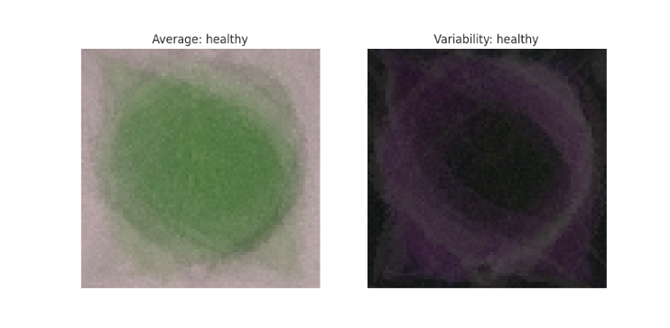

    _Visualization of the average color and variability of healthy leaves._

    **Average Infected Leaves**
    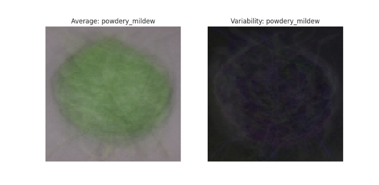

     _Visualization of the average color and variability of infected leaves._

    **Difference Between Healthy and Infected Leaves**
    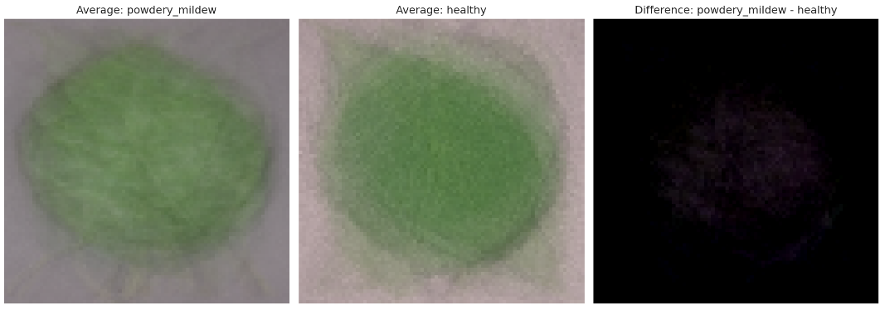

    _Visualization of the color difference between healthy and infected leaves._

    * While color differences were evident, no readily apparent shape-based patterns were identified that could reliably distinguish between the two categories.

-   **Machine Learning Model Performance:**

    * The machine learning pipeline achieved a classification accuracy of 99% in distinguishing between healthy and diseased cherry leaves.

    

    _Graph showing performance metrics for the model_

    * This result validates the hypothesis that a high-accuracy model could be developed using the provided dataset.
    * The performance metrics displayed in the image, showcase a high level of precision (99%), recall (99%) and F1 score (99%), thus validating the model's accuracy. A high precision indicates that the model rarely misclassifies a healthy leaf as infected, while a high recall means that it effectively identifies most of the infected leaves. The F1 score, which combines precision and recall, confirms the model's overall effectiveness.

## Rationale for Mapping Business Objectives to Data Visualizations and Machine Learning Tasks

### ***Business Objective 1: Visual Differentiation Research***

The client requires a visual analysis to distinguish between healthy cherry leaves and those affected by powdery mildew.

> **Data Visualization Strategy**

* **Comparative Analysis of Mean and Standard Deviation Images:** The interactive dashboard will present mean and standard deviation images of both healthy and powdery mildew-infected cherry leaves. This will allow for a direct visual comparison, highlighting characteristic features and variability within each category.
* **Visualization of Average Leaf Difference:** A dedicated visualization will demonstrate the difference between the average healthy leaf and the average powdery mildew-infected leaf. This will clearly illustrate the key visual distinctions that differentiate the two categories.
* **Image Montage for Side-by-Side Comparison:** An image montage featuring representative samples of both healthy and powdery mildew-infected leaves will be displayed. This side-by-side comparison will facilitate the identification of subtle and obvious visual patterns.

### ***Business Objective 2: Image Classification for Powdery Mildew Detection***

The client needs a system to classify individual cherry leaf images as either healthy or infected with powdery mildew.

> **Machine Learning Task: Binary Classification**

* **Development of a Binary Classification Model:** A machine learning model, specifically a binary classifier, will be developed to analyze input cherry leaf images and accurately predict whether each leaf is healthy or infected with powdery mildew. This model will provide an automated and efficient solution for image classification.
* **Model Performance Evaluation:** The model's performance will be rigorously evaluated by analyzing loss and accuracy metrics. This will ensure the model's reliability and effectiveness in classifying leaf images.
* **Prediction Report Generation and Download:** Functionality will be implemented to allow users to generate and download a comprehensive prediction report for uploaded photos. This report will provide detailed classification results, enhancing the user experience and facilitating data sharing.

## Cross-Industry Standard Process for Data Mining (CRISP-DM) Methodology

This project followed the Cross-Industry Standard Process for Data Mining (CRISP-DM) methodology to ensure a structured and comprehensive approach to development.

_Image representing the CRISP-DM methodology stages._

**1. Business Understanding**

The project addresses two key business objectives:

> **Business Objective 1: Visual Differentiation Research**

* Conduct a visual analysis to distinguish between healthy cherry leaves and those affected by powdery mildew.
    * Analyze average images and variability images for each class (healthy or powdery mildew).
    * Examine the differences between average healthy and average powdery mildew cherry leaves.
    * Create an image montage for each class.

> **Business Objective 2: Image Classification for Powdery Mildew Detection**

* Develop an ML system capable of predicting whether a cherry leaf is healthy or contains powdery mildew.

**2. Data Understanding**

The project utilizes the [Kaggle dataset](https://www.kaggle.com/datasets/codeinstitute/cherry-leaves) provided by Code Institute, containing over 4,000 images of healthy and affected cherry leaves.

* **Data Collection:** Retrieve data from the Kaggle dataset and store it as raw data.

**3. Data Preparation**

* **Data Cleaning:** Clean the data by checking for and removing any non-image files.
* **Dataset Splitting:** Split the data into training, validation, and test sets.
* **Image Standardization:** Define and apply consistent image shapes for processing.
* **Image Analysis:**
    * Calculate the average and variability of images for each class (healthy and powdery mildew).
    * Load image shapes and labels into an array.
    * Plot and save the mean variability of images for each class.
    * Calculate and visualize the difference between the average healthy and powdery mildew-infected leaf.
    * Create image montages for visual comparison.
* **Data Augmentation:** Apply image data augmentation techniques to increase dataset diversity and model robustness.

**4. Modeling**

* **Model Selection:** Choose an appropriate machine learning model, such as a Convolutional Neural Network (CNN), for image classification.
* **Model Training:** Train the selected ML model using the training dataset.
* **Model Saving:** Save the trained model for future use and deployment.

**5. Evaluation**

* **Performance Visualization:** Plot the model's learning curve to visualize training loss and accuracy over time.
* **Model Testing:** Evaluate the trained model's performance on the test dataset using appropriate metrics (e.g., accuracy, precision, recall, F1-score).
* **Prediction Testing:**
    * Load a random image for prediction.
    * Convert the image to an array and prepare it for model input.
    * Predict class probabilities and evaluate the results.

**6. Deployment**

* **Model Deployment:** Deploy the trained and evaluated model into a production environment for real-world use.

## Machine Learning Business Case

This project addresses a critical business need for Farmy & Foods: automating the detection of powdery mildew in cherry leaves. Currently, manual inspection is time-consuming and inefficient. This project leverages machine learning to develop a system that accurately classifies cherry leaf images as healthy or infected.

### Project Goals

* Visual Analysis: Provide an interactive dashboard for visualizing and comparing healthy and infected leaves.
* Image Classification: Develop a machine learning model that accurately predicts the health status of cherry leaves.

### Solution

A binary classification model, specifically a Convolutional Neural Network (CNN), will be trained on a dataset of cherry leaf images. This model will be integrated into an interactive dashboard, allowing users to upload images and receive predictions.

### Client Benefits

* Improved Efficiency: Automate the detection process, saving time and resources.
* Enhanced Accuracy: Achieve high accuracy in disease detection.
* Scalability: Easily scale the solution to accommodate larger datasets and future applications.

This project will deliver a valuable tool for Farmy & Foods, improving their ability to manage powdery mildew and maintain the quality of their cherry crops.

## Model Details

The machine learning model employed in this project is a Convolutional Neural Network (CNN) designed for binary image classification. 

* **Architecture:** The model utilizes a sequential architecture, where layers are arranged in a linear sequence.
* **Layers:** It consists of three convolutional layers for feature extraction, followed by a MaxPooling2D layer after each.  A Flatten layer precedes a dense layer with 256 neurons for further processing.
* **Regularization:** Dropout layers and early stopping are implemented to mitigate overfitting and enhance generalization.
* **Output Layer:** The final layer has a single neuron with a sigmoid activation function, producing a probability score for classification.
* **Loss Function:** Binary cross-entropy is used as the loss function, suitable for binary classification problems.
* **Optimizer:** The Adam optimizer is employed for efficient model training.

_Image showing a summary of the CNN model architecture._

## Dashboard Design

The interactive dashboard provides a user-friendly interface for exploring the data, visualizing model results, and performing predictions. It comprises the following pages:

**1. Navigation**

A consistent navigation bar ensures easy access to all dashboard pages.

Navigation Image

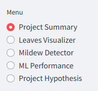

_Image showing the navigation bar of the dashboard._

**2. Project Summary**

This page provides an overview of the project, including:

* **Project Summary:** Concise description of the project's objectives and scope.
* **Project Dataset:** Information about the dataset used, including source and characteristics.
* **Business Requirements:** Clearly defined business objectives.
* **Link to README:** Hyperlink to this README file for detailed documentation.

Project Summary Page Image

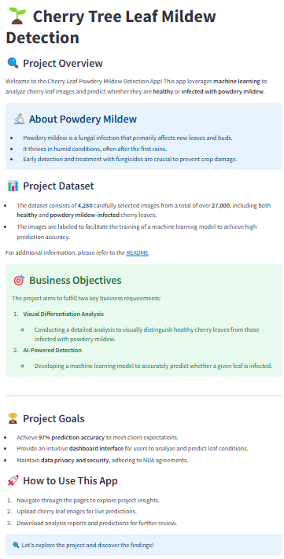

_Image showing the project summary page of the dashboard._

**3. Leaf Visualizer**

This page facilitates visual exploration of the cherry leaf dataset:

* **Business Requirement 1:** Restatement of the visual differentiation objective.
* **Interactive Visualizations:**
    * **Checkbox 1: Difference between average and variability image:** Displays the average and variability images for each class (healthy and powdery mildew), along with an explanation of the visualization.
    * **Checkbox 2: Differences between the average image of healthy and powdery mildew infected leaves:** Highlights the differences between the average images of healthy and infected leaves, with detailed explanations.
    * **Checkbox 3: Image montage:** Allows users to create and view image montages for each class, with instructions and explanations provided.

Leaf Visualizer Page Image

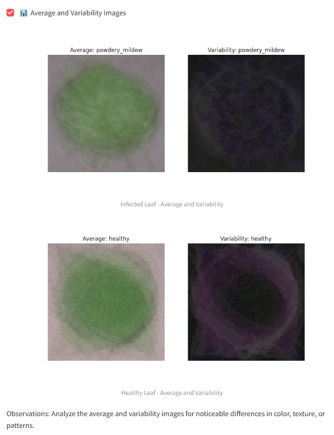

_Image showing the leaf visualizer page with the average and variability image display._

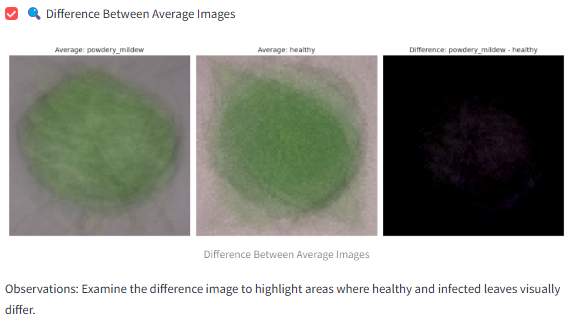

_Image showing the leaf visualizer page with the difference between average images._

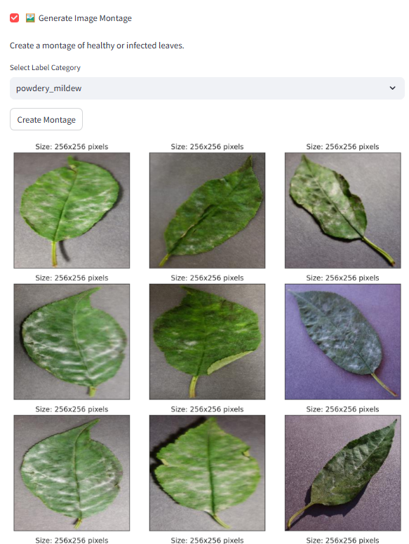

_Image showing the leaf visualizer page with the interactive interface for creating and displaying user-defined image montages._

**4. Powdery Mildew Detector**

This page enables users to perform predictions on new cherry leaf images:

* **Business Requirement 2:** Restatement of the image classification objective.
* **Prediction Interface:**
    * **Live prediction info and hyperlink to download images:** Provides information about live prediction status and a link to download sample cherry leaf images.
    * **File uploader:** Allows users to upload cherry leaf images for prediction.
    * **Prediction results:** Displays the uploaded image, the predicted diagnosis (healthy or infected), the probability score, and a bar plot visualization.
    * **Analysis report table:** Presents a table summarizing the prediction results for all uploaded images.
    * **Download report link:** Enables users to download a comprehensive prediction report.

Powdery Mildew Detector Page Image

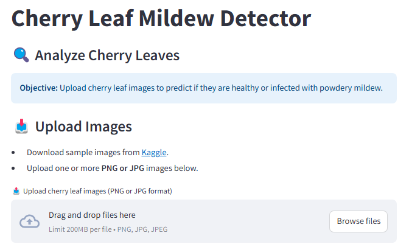

_Image showing the Powdery Mildew Detector page with the file uploader and live prediction info._

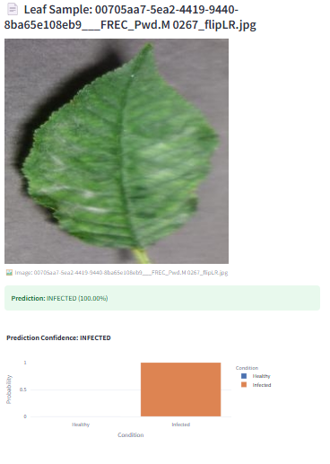

_Image showing the Powdery Mildew Detector page with prediction results and analysis report._

**5. ML Performance Metrics**

This page presents detailed information about the machine learning model's performance:

* **Average Image size in dataset:** Displays the average image size in the dataset with a visual representation and explanation.
* **Train, Validation and Test Set: Label Frequencies:** Shows the distribution of labels in each dataset split with a plot and explanation.
* **Model History:** Provides insights into the model's training process, including accuracy and loss over time.
* **Generalized Performance on Test Set:** Presents the model's performance on the test set using key metrics.

ML Performance Metrics Image

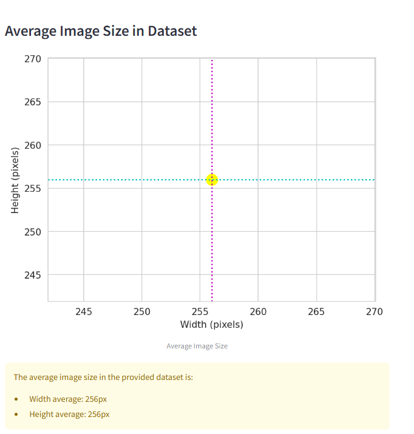

_Image showing the average image size visualization._

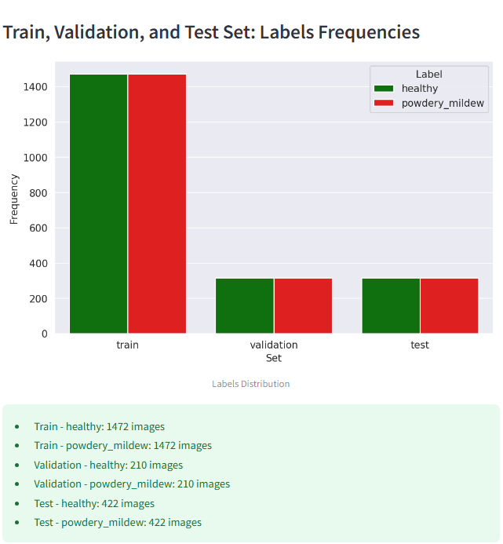

_Image showing the label frequencies in the dataset splits._

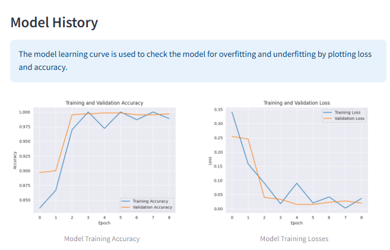

_Image showing the model's training history (loss and accuracy)._

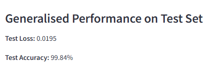

_Image showing the model's generalized performance metrics on the test set._

**6. Project Hypotheses and Validation**

This page documents the project's hypotheses and validation results:

* **Detailed explanation of powdery mildew disease:** Provides background information on powdery mildew.
* **Hypotheses:** States the hypothesis that powdery mildew on cherry leaves exhibits visually detectable characteristics for automated detection.
* **Validation:** Presents the validation results of machine learning models and their implications.
* **Next steps** Describes the planned next steps of the project.

Project Hypotheses and Validation Page Image

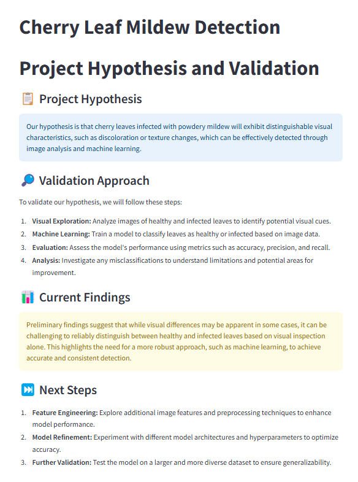

_Image showing the Project Hypotheses and Validation page._

## Forking and Cloning the Repository

**Forking:**

To create a personal copy of this repository on your GitHub account, follow these steps:

1. Navigate to the repository you wish to fork.
2. Click the "Fork" button located in the upper right corner of the page.

**Cloning:**

To download a copy of the repository to your local machine, follow these steps:

1. Navigate to the repository you wish to clone.
2. Click the green "<> Code" button and copy the provided URL for your preferred cloning method (HTTPS, SSH, or GitHub CLI).
3. Open your terminal or command prompt.
4. Navigate to the directory where you want to store the cloned repository using the `cd` command.
5. Execute the command `git clone` followed by the copied URL.
6. Press Enter to create a local clone of the repository.

## Core Technologies and Libraries

This project leverages a variety of technologies and libraries to achieve its objectives:

**Programming Language:**

* Python

**Essential Libraries for Implementation:**

* **NumPy:** Used for numerical computing and array manipulation, particularly for converting images into arrays for model input.
* **Pandas:** Employed for data manipulation and analysis, enabling efficient handling of tabular data.
* **Matplotlib:** Utilized for creating static, interactive, and animated visualizations in Python.
* **Seaborn:** Built on top of Matplotlib, Seaborn provides a high-level interface for creating informative and visually appealing statistical graphics.
* **Plotly:** Used for generating interactive charts and visualizations, enhancing data exploration and presentation.
* **Streamlit:** Employed to build the interactive dashboard, providing a user-friendly interface for data visualization and model interaction.
* **TensorFlow:** A powerful open-source library for numerical computation and large-scale machine learning, used for building and training the CNN model.
* **Keras:** A high-level API for building and training neural networks, providing a user-friendly interface for TensorFlow.
* **PIL (Pillow):** Used for image processing tasks, such as opening, manipulating, and saving different image file formats.

**Platforms and Tools:**

* **GitHub:** Used for version control, collaboration, and code storage.
* **Gitpod:** Provided the development environment for this project, enabling efficient and reproducible coding.
* **Kaggle:** The source of the cherry leaf image dataset used for model training and evaluation.
* **Heroku:** Used for deploying the web application, making it accessible to users.

## Credits and Acknowledgements

**Content and Inspiration:**

* **Malaria Detector Project:** Served as a valuable reference and learning resource. 
* **ChatGPT:** Assisted with troubleshooting and provided additional information.
* **Peer Projects (Slack):** Projects shared by fellow students on Slack provided inspiration and practical insights.
* **Code Institute Slack Channel:** A valuable platform for community support and knowledge sharing.

---

